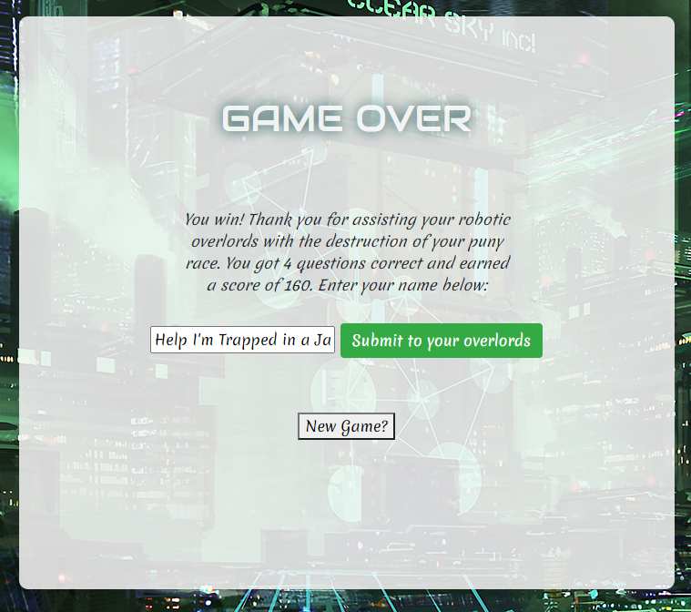

# Legends of Javascript
## The Highest Stakes Quiz Game You'll Ever Play

**Legends of Javascript** is a timed quiz app where you answer javascript questions as quickly as possible to achieve a high score, which will certainly not result in the destruction of all humans by murderous javascript robots.  The app uses Bootstrap for responsive layout.

## Features
### Gameplay

Gameplay consists of 10 questions presented in a random order.  Answers are randomized to increase replayability.  Your score and the time remaining are tracked dynamicly in the page footer.  When you click on an answer, the screen flashes green or red to indicate whether you picked the correct one.  (Protip: always tell the bots you'll support them.)

### Score Tracking

The list of high scores is available at any time via a button in the footer.  Opening the high scores list will pause the game until you close it.  Your position on the list is responsive to how your current score stacks up against the existing high scores.  Scores are saved in localStorage, so they persist across page reloads.

### Intelligent Game Over Screen

The game over screen switches between telling you that you won or lost based on whether the game ended due to completing all questions or because you ran out of time.  You can submit your name to enter your score into the local list of high scores.  See if you can knock all those pesky QuizBots off the list!

## Check out the website!

> https://nvanbaak.github.io/legends-of-javascript/
